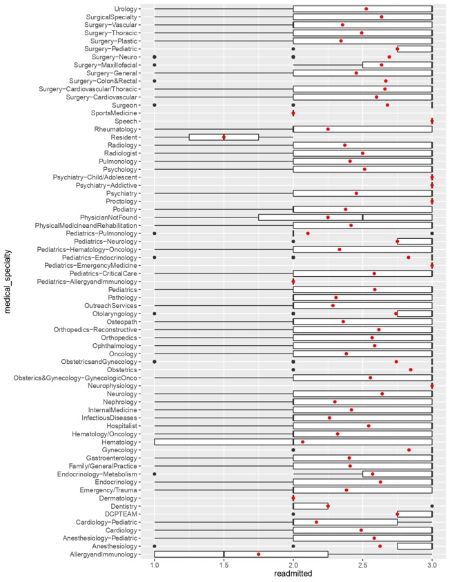
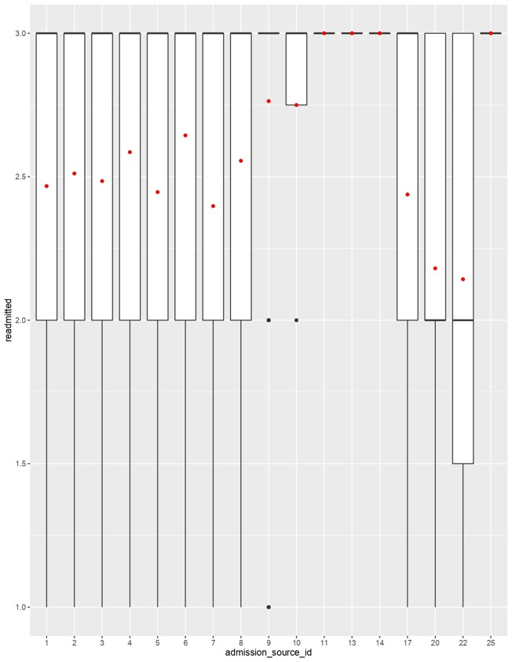
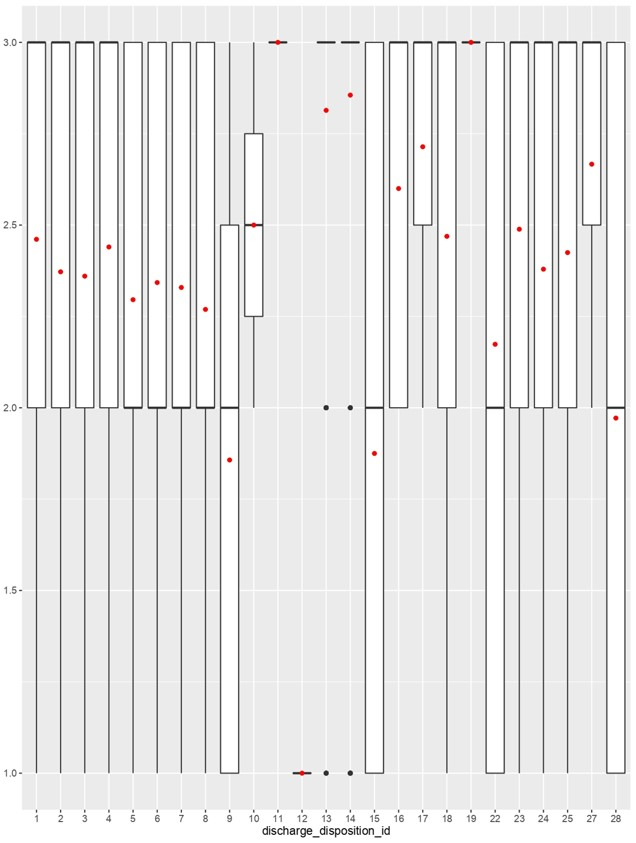
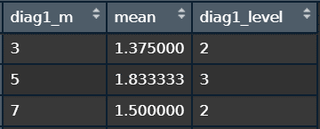

# Numerical-Data-Forecasting-with-R
To analyze whether a patient will be rehospitalized (a binary classification problem).

# Data
Each patient's data, including gender, age, weight, etc., totals 70,000 records with 48 features.

# Feature Engineering
Features are categorized into categorical data and numerical data, each with different methods of analysis and processing.

## Categorical Data (Feature)
* Patient number
  
  * The number of times a patient appears has quite a significant impact on the likelihood of rehospitalization.

  * The total occurrences of each patient number are to be added as a numerical variable. Categorize the occurrence count (classification basis: 1, 2&3, more) and add a
  categorical variable.

* medical_specialty

  * There are too many types of this feature, which raises concerns about the potential for noise generation. 

  * The box plot reveals the relationship between each category of 'medical_specialty' and the target variable 'readmitted'. The x-axis represents the target variable 'readmitted', and the y-axis represents each category within the 'medical_specialty' feature. The red dots indicate the average number of readmissions for each category, showing where the average readmission falls for each category.

  * Categories with similar averages of readmitted, such as 'Resident' and 'AllergyandImmunology' which both have averages around 1.5, are grouped together into one category.
  
 

* admission_source_id

  * There are too many types of this feature, which raises concerns about the potential for noise generation.

  * The box plot reveals the relationship between each category of 'admission_source_id' and the target variable 'readmitted'. The x-axis represents the target variable 'readmitted', and the y-axis represents each category within the 'admission_source_id' feature. The red dots indicate the average number of readmissions for each category, showing where the average readmission falls for each category.

  * Categories with similar averages of readmitted, such as '10', '11', '13', and '14' are grouped together into one category, this category replace admission_source_id. 

* discharge_disposition_id

  * There are too many types of this feature, which raises concerns about the potential for noise generation.

  * The box plot reveals the relationship between each category of 'discharge_disposition_id' and the target variable 'readmitted'. The x-axis represents the target variable 'readmitted', and the y-axis represents each category within the 'admission_source_id' feature. The red dots indicate the average number of readmissions for each category, showing where the average readmission falls for each category.

  * Categories with similar averages of readmitted, such as '22', '15', '28', and '5' are grouped together into one category, this category replace discharge_disposition_id.

* diagnosis

  * There are too many types of this feature, which raises concerns about the potential for noise generation.
    
  * Categories with similar averages of readmitted, such as '10', '11', '13', and '14' are grouped together into one category, so this category is a new feature

## Numerical Data (Feature)
* time in hospital
  * High correlation between two variables can cause multicollinearity, where one variable can be highly predictable from the other.
 
  * So we delete one of the two variables that have high correlation.

# Model
Xgboost
